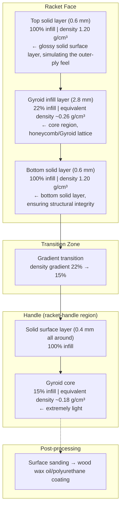
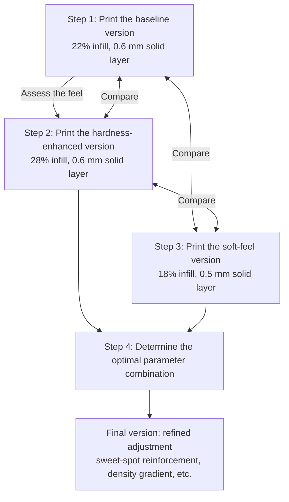

# SUPER O C T O — The Adventure Plan: An Ultra-Light Table Tennis Racket Made from 3D-Printed Artificial Wood

> **Core idea**: Abandon the conventional paradigm of manufacturing a blade by stacking multiple layers of natural wood and instead use **3D-printed artificial wood (wood-filled PLA / wood-composite filament)**, replacing the solid wood of natural timber with an internal lattice structure (infill lattice) to achieve **integrated structural–weight–centre-of-gravity design** and pursue extreme lightweight construction.
>
> **Adventure rating**: ★★★★★ (extremely high — no commercial precedent exists, but technical feasibility is assured)

---

## 1 Motivation: Why Is an "Adventure Plan" Needed?

The three existing design schemes (Schemes 1/2/3; see [Three Blade Design Schemes and Procurement List](./%E9%98%B6%E6%AE%B52-%E8%B0%83%E7%A0%94%E4%BB%A5%E5%8F%8A%E6%9D%90%E6%96%99%E5%87%86%E5%A4%87/Three%20Blade%20Design%20Schemes%20and%20Procurement%20List.en.md) for details), although already progressively aggressive, are all based on one common underlying assumption—**that the blade must be constructed from layers of natural wood**. This assumption comes from the "85 % natural wood" rule of the International Table Tennis Federation (ITTF) (Article 2.4.2) and from the craft tradition accumulated over two centuries of table-tennis-racket manufacturing.

Article 2.4.2 of the ITTF rules states as follows[^1]:

> **2.4.2** — At least 85% of the blade by thickness shall be of natural wood; an adhesive layer within the blade may be reinforced with fibrous material such as carbon fibre, glass fibre or compressed paper, but shall not be thicker than 7.5% of the total thickness or 0.35 mm, whichever is the smaller.

In addition, the ITTF M4 technical manual gives the following official explanation of "Natural wood"[^2]:

> **"Natural wood (Law 2.4.2) implies continuity throughout the blade; this permits plywood but not, for example, particle-board, flake-board and other composites."**
>
> ("Natural wood" implies that the blade as a whole should be a continuous wood structure; this permits plywood but **does not permit particle-board, flake-board, or other composites**.)

This explanation almost entirely rules out the competition-compliance possibility of 3D-printed artificial wood (Wood PLA), for the following reasons:

- The essence of Wood PLA filament is a composite of **wood powder + PLA (a polyester bioplastic) binder**, which is highly similar to particle-board in material composition.
- Even with a custom filament of high wood-powder content (60 %–70 %), the matrix is still a composite structure in which wood-powder particles are dispersed in a plastic matrix, rather than continuous wood.
- The ITTF requirement for "continuity throughout the blade" means that **a continuous wood grain must be observable on the cross-section of the blade**—something that 3D-printed artificial wood can by no means satisfy.

### Historical Retrospective: The 2017 Attempt to Abolish the Natural-Wood Rule

At the 2017 ITTF Annual General Meeting, Hong Kong, China and Korea jointly proposed a motion **recommending the abolition of the mandatory "85 % natural wood" rule**, to allow blades to use other materials such as carbon fibre, plastics, and metals—similar to the material transitions already completed in sports such as tennis, badminton, and squash[^3].

Although the proposal failed to obtain the 75 % majority required for passage, the alternative "Resolution D"—to initiate the relevant feasibility study—passed smoothly with 151 out of 186 votes (exceeding 50 %). The ITTF subsequently set up a dedicated committee or working group to explore rule amendments, proposing to change the blade rule to:

> **"The blade shall be made of one or more layers of natural wood or other solid materials, without cavities and not compressible."**
>
> (The blade shall be made of one or more layers of natural wood or other solid materials, without cavities and not compressible.)

However, **as of the 2025 edition of the ITTF Statutes, Article 2.4.2 remains unchanged**—the 85 % natural-wood rule is still in force. The 2017 reform effort did not ultimately come to fruition.

The significance of this for the Octo project is:

> ⚠️ **Scheme 4 has now been definitively judged to be non-compliant with ITTF competition rules**—Wood PLA, as a "wood-powder + plastic composite", does not meet the definition of "natural wood", and the internal voids of the lattice may also violate the "continuity" requirement.
>
> **For competitive use**: Schemes 1/2/3 (compliant natural-wood laminated blades) should be adhered to.
> **For the positioning of Scheme 4**: it is an excellent platform for **technical exploration, training rackets, recreational rackets, demonstration projects, and functional prototypes**—its competition-compliance threshold is now clearly defined, and no illusion should be entertained, but this does not detract from its technical-innovation value.

---

## 2 Technical Basis: 3D-Printed Artificial Wood and Lattice Structure

### 2.1 Material Selection

| Material | Density (g/cm³) | Wood-powder content | Printing temperature | Interlayer adhesion | Post-processing capability |
| :--- | :----------: | :------: | :------: | :--------: | :--------: |
| Ordinary Wood PLA | 1.20–1.30 | 30 %–40 % | 190–220 °C | ★★★★ | Sandable, colourable, oilable |
| High-wood-powder Wood PLA | 1.10–1.20 | 40 %–50 % | 200–230 °C | ★★★ | Fairly brittle, handle with care |
| Carbon-fibre-reinforced PETG | 1.20–1.28 | — | 230–260 °C | ★★★ | Good rigidity, impact-resistant |
| Bamboo PLA | 1.10–1.20 | 30 %–35 % (bamboo powder) | 190–220 °C | ★★★★ | Similar to Wood PLA |
| Pure wood-powder paste (experimental) | 0.90–1.10 | 60 %–70 % | Requires a dedicated printer | ★★ | Post-processing is difficult |

> **Table 1: Comparison of 3D-printed artificial-wood materials**
>
> **Top recommendation**: ordinary Wood PLA (e.g. eSUN Wood PLA, Amolen Wood PLA); the printing process is mature, post-processing is almost indistinguishable from real wood (sandable, can be finished with wood wax oil), and the density is about 1.2 g/cm³ (solid print).

### 2.2 Principle of Weight Reduction by Lattice Structure

Unlike traditional solid wood, 3D printing can greatly reduce the effective density through **internal infill**:

| Infill pattern | Infill ratio | Equivalent density (g/cm³) | Structural characteristics | Suitable for |
| :------- | :----: | :--------------: | :------- | :----- |
| Honeycomb | 15 %–25 % | 0.18–0.30 | Good isotropy, compression-resistant | **Core** |
| Gyroid | 15 %–30 % | 0.18–0.36 | Uniform in three directions, good vibration absorption | **Core (preferred)** |
| Triangle | 20 %–40 % | 0.24–0.48 | High rigidity, slightly heavier | **Handle/connection zone** |
| Grid | 10 %–20 % | 0.12–0.24 | Simple, but anisotropic | Ultra-light schemes |
| Variable density | 10 %–40 % | 0.12–0.48 | Dense in key regions, sparse elsewhere | **Global optimum** |

> **Table 2: Conversion between infill ratio and equivalent density** (based on a Wood PLA solid density of 1.2 g/cm³)

**Key insight**: with 15 %–20 % Gyroid infill, the equivalent density of a Wood PLA print can be reduced to **0.18–0.24 g/cm³**—comparable to, or even lighter than, Balsa wood (0.10–0.20 g/cm³). Moreover, the three-dimensional uniform structure of Gyroid provides better impact resistance than Balsa wood.

### 2.3 Characteristics of Lattice Structures for Table Tennis Rackets

| Characteristic | Natural wood (solid) | 3D-printed Gyroid lattice | Impact of difference |
| :--- | :-------------: | :-----------------: | :--- |
| Density range | 0.10–1.10 g/cm³ | **0.12–0.48 g/cm³** (precisely controllable) | Can be matched precisely to the target |
| Stiffness-to-weight ratio | Depends on the wood species | **Programmable gradient** (dense racket face/sparse handle) | **Great freedom in CG design** |
| Vibration attenuation | Large variation among woods | The Gyroid structure naturally absorbs vibration | The feel may be "muffled" |
| Impact resilience | Wood fibre directionality | Isotropic or anisotropic design | Can simulate different feels |
| Stress concentration | Wood knots/grain defects | No natural defects; the interlayer bond is the weak point | Interlayer adhesion must be optimised |

---

## 3 Scheme 4: 3D-Printed One-Piece Lattice Blade

### 3.1 Design Concept

Using the **one-piece moulding** capability of 3D printing, the racket face and the handle
(including the grip) are designed as a single integral part with **gradient infill** inside:



### 3.2 Parameter Table

| Part | Region | Infill pattern | Infill ratio | Equivalent density (g/cm³) | Layer thickness (mm) | Remarks |
| :--- | :--- | :------: | :----: | :--------------: | :--------: | :--- |
| Racket face | Outer layer (solid) | — | 100 % | 1.20 | 0.6 × 2 faces | Simulates the outer ply, ensures a flat hitting surface |
| Racket face | Core | Gyroid | 22 % | 0.26 | 2.8 | Main weight-reduction region |
| Racket face | Internal reinforcing ribs | Triangle | 35 % | 0.42 | — | Local densification beneath the sweet spot (40 mm-diameter region) |
| Transition zone | Gradient | Gyroid | 22 % → 15 % | 0.26 → 0.18 | 5.0 | Density gradient from the racket face to the handle |
| Handle | Outer layer (solid) | — | 100 % | 1.20 | 0.4 × all around | Ensures grip strength |
| Handle | Core | Gyroid | 15 % | 0.18 | — | Main weight-reduction region |
| **Total** | | | **Weighted average** | **~0.28** | **5.6** | **Racket-face area ~190 cm²** |

### 3.3 Weight Estimation

#### 3.3.1 Racket-Face Part

| Component | Volume estimate (cm³) | Equivalent density (g/cm³) | Weight (g) |
| :--- | :--------------: | :--------------: | :------: |
| Racket-face surface layers (solid on both faces, 0.6 mm each) | 190 × 0.06 × 2 = 22.8 | 1.20 | 27.4 |
| Core Gyroid (2.8 mm, 22 % infill) | 190 × 0.28 × 0.22 = 11.7 | 1.20 | 14.0 |
| Sweet-spot reinforcing ribs (local, ≈ 20 cm² × 0.28, extra 35 % infill) | 20 × 0.28 × 0.35 = 2.0 | 1.20 | 2.4 |
| **Racket-face subtotal** | | | **~43.8** |

#### 3.3.2 Handle Part

Simplified model: the handle is approximated as a 70 × 24 × 18 mm rectangular solid.

| Component | Volume estimate (cm³) | Equivalent density (g/cm³) | Weight (g) |
| :--- | :--------------: | :--------------: | :------: |
| Handle solid outer layer (0.4 mm thick, approximated by the all-around surface area) | (70 × 24 × 18 with a 0.4 mm surface wrap) ≈ 2.4 | 1.20 | 2.9 |
| Handle Gyroid core (15 % infill) | (70 × 24 × 18) × 0.85 × 0.15 ≈ 3.9 | 1.20 | 4.7 |
| **Handle subtotal** | | | **~7.6** |

#### 3.3.3 Total Weight

| Component | Weight (g) |
| :--- | :------: |
| Racket face | 43.8 |
| Handle | 7.6 |
| Surface coating (2 coats of polyurethane) | 2.0 |
| **Blade total weight** | **~53.4** |

**Comparison**: in [Three Blade Design Schemes and Procurement List](./%E9%98%B6%E6%AE%B52-%E8%B0%83%E7%A0%94%E4%BB%A5%E5%8F%8A%E6%9D%90%E6%96%99%E5%87%86%E5%A4%87/Three%20Blade%20Design%20Schemes%20and%20Procurement%20List.en.md), the Scheme-3 (5+2 fibre composite) blade weighs 44–51 g. Scheme 4 achieves **53.4 g**—slightly heavier, but this weight includes the entire weight of the handle (in Scheme 3 the handle weight of 12–15 g is counted separately).

#### 3.3.4 Finished-Racket Total-Weight Estimation

| Component | Weight (g) |
| :--- | :------: |
| Blade (incl. one-piece handle) | 53.4 |
| Rubbers (ultra-light scheme, 36 g per side + 3 g glue) | 75.0 |
| **Total weight of finished racket** | **~128.4** |

**Conclusion**: 128.4 g lies within the 110–130 g target range, and no separate handle assembly or counterweight mechanism is required.

### 3.4 Further Weight-Reduction Possibilities

| Optimisation item | Current value | Limit value | Weight-reduction effect |
| :----- | :----: | :----: | :------: |
| Racket-face solid-layer thickness | 0.6 mm | 0.4 mm | −9 g |
| Gyroid infill ratio | 22 % | 15 % | −5 g |
| Handle infill ratio | 15 % | 10 % | −1.5 g |
| Reduction of the sweet-spot reinforcement area | 40 mm circle | 30 mm circle | −1 g |
| **Total limit optimisation** | | | **−16.5 g** → **finished racket ~112 g** |

This means that through aggressive optimisation, **the finished racket is expected to break below
115 g, approaching the 110 g lower limit**.

---

---

## 4 Design and Implementation

### 4.1 Printer Requirements

| Parameter | Minimum requirement | Recommended configuration |
| :--- | :------: | :------: |
| Build volume | ≥ 200 × 160 × 30 mm | ≥ 220 × 220 × 250 mm |
| Nozzle diameter | 0.4 mm | 0.4 mm (a 0.2 mm nozzle cannot be used with Wood PLA, as it clogs easily) |
| Heated bed | Heatable to 60 °C | With a PEI or glass plate |
| Extruder | Direct drive (DD) or Bowden | Direct drive (Wood PLA is fairly soft and tends to jam in a Bowden tube) |
| Enclosure | Not essential (recommended) | Reduces warping and improves surface quality |

### 4.2 Recommended Printing Parameters

| Parameter | Value | Remarks |
| :--- | :-: | :--- |
| Material | eSUN Wood PLA / Amolen Wood PLA | Wood-powder content ~30 %, prints smoothly |
| Nozzle temperature | 200–210 °C | Above 220 °C the wood powder carbonises |
| Bed temperature | 50–60 °C | Good adhesion |
| Layer height | 0.12 mm (racket face) / 0.20 mm (handle) | The racket face needs a fine surface |
| Shell count | 3–4 | Ensures surface strength |
| Top/bottom layers | 5 | Prevents the infill pattern from showing through |
| Infill pattern | Gyroid | Weight reduction + uniform stress |
| Printing speed | 40–50 mm/s | Wood PLA should not be printed too fast |
| Skirt/brim | Brim (5 mm) recommended | Prevents warping |

### 4.3 Post-Processing

A 3D-printed Wood PLA surface has a genuine wood texture, and the post-processing methods are almost the same as for real wood:

| Step | Operation | Tool | Effect |
| :--- | :--- | :--- | :--- |
| 1 | **Sanding** | Sandpaper #120 → #240 → #400 | Removes layer lines and gives a wood-like surface |
| 2 | **Filling** | Wood filler to fill print defects | A flat surface |
| 3 | **Sanding** | Sandpaper #400 → #800 | Fine sanding |
| 4 | **Colouring** (optional) | Wood stain/acrylic paint | Individualised colour scheme |
| 5 | **Sealing** | Wood wax oil / matte polyurethane varnish, 2 coats | Protects the surface and increases durability |
| 6 | **Handle anti-slip** | Cork sheet / sweat-band wrapping | Anti-slip and sweat-absorbing |

> After sanding and oiling, the Wood PLA surface is almost indistinguishable in appearance from real wood, and its hardness is superior to that of most softwoods.

---

## 5 Scheme 4 vs. Schemes 1/2/3

| Comparison item | Scheme 1 (conservative) | Scheme 2 (advanced) | Scheme 3 (aggressive) | **Scheme 4 (adventurous)** |
| :----- | :-----------: | :-----------: | :-------------: | :----------------: |
| **Core process** | Manual veneer bonding | Manual veneer bonding | Manual veneer bonding + fibre | **3D-printed one-piece moulding** |
| **Structure** | 3-ply all-wood | 5-ply all-wood | 5+2 fibre composite | **Lattice-filled one-piece** |
| **Material** | Limba + Balsa | Limba + Kiri + Balsa | Limba + ALC + Kiri + Balsa | **Wood PLA (artificial wood)** |
| **Blade weight (est.)** | 36–44 g | 43–50 g | 44–51 g | **~53 g (incl. handle)** |
| **Finished weight (est.)** | 111–119 g | 118–125 g | 119–126 g | **~128 g (can be reduced to 112 g)** |
| **ITTF compliance** | ✅ 100 % wood | ✅ 100 % wood | ✅ wood >85 % | ❌ **Non-compliant (see Section 1)** |
| **Fabrication difficulty** | ★☆☆☆☆ (very easy) | ★★☆☆☆ (easy) | ★★★★☆ (fairly difficult) | ★★★☆☆ (moderate) |
| **Material cost** | ~50–80 CNY | ~70–100 CNY | ~100–180 CNY | **~30–60 CNY (incl. filament)** |
| **Equipment cost** | Basic tools ~200 CNY | Basic tools ~200 CNY | Basic tools ~200 CNY | **3D printer ~800–2000 CNY** |
| **Manufacturing time** | 1–2 days | 2–3 days | 3–5 days | **6–12 h (printing) + 1 day post-processing** |
| **Design freedom** | ★★ | ★★ | ★★★ | **★★★★★ (stepless adjustment)** |
| **Reproducibility** | Low (large manual deviation) | Low (large manual deviation) | Medium (manual deviation) | **Extremely high (the STL file is the standard)** |
| **Iterability** | Requires re-purchasing materials | Requires re-purchasing materials | Requires re-purchasing materials | **Only needs parameter changes and re-printing** |

---

## 6 Feel Tuning of the Lattice Structure

### 6.1 Programmable Hardness

| Tuning method | Parameter variation | Feel variation | Weight variation |
| :------- | :------: | :------- | :------: |
| Increase/decrease infill ratio | ±5 % | Infill ratio +5 % → hardness + (perceptible) | +3–4 g |
| Surface solid-layer thickness | ±0.1 mm | Thickness +0.1 mm → hardness + (noticeable) | +2.3 g |
| Change infill pattern | Gyroid ↔ Honeycomb ↔ Triangle | Different resilience and vibration absorption | Little difference |
| Sweet-spot reinforcement area | ±10 mm | Area +10 mm → larger sweet spot, slightly higher hardness | +1–2 g |
| Material switch | Wood PLA ↔ carbon-fibre PETG | PETG is tougher, feel is crisper | Similar density |

### 6.2 Recommended Tuning Route



> Because the marginal cost of 3D printing is extremely low (printing one blade uses about 30–50 CNY of filament), **5–10 versions with different parameters can easily be printed for feel comparison**—an iteration efficiency unimaginable in traditional solid-wood schemes.

---

## 7 Cost Budget and Implementation Route

### 7.1 One-Time Equipment Investment

| Item | Quantity | Estimated unit price | Remarks |
| :--- | :-: | :------: | :--- |
| 3D printer (Bambu Lab A1 Mini recommended) | 1 | 1,599 CNY | Suitable for beginners, automatic levelling |
| Wood PLA filament (1 kg spool) | 1 roll | 60–100 CNY | Can print about 8–12 blades |
| Basic post-processing tools (sandpaper, wood wax oil, brush) | 1 set | 50–80 CNY | General-purpose |
| **Equipment subtotal** | | **~1,710–1,780 CNY** | The printer is a long-term investment |

### 7.2 Cost per Blade

| Item | Usage | Estimated cost |
| :--- | :--: | :------: |
| Wood PLA filament | ~80–100 g | 6–10 CNY |
| Sandpaper consumption | 2–3 sheets | 2–3 CNY |
| Wood wax oil/varnish | Small amount | 2–5 CNY |
| **Material cost per blade** | | **~10–18 CNY** |

**Comparison**: the material cost of Scheme 3 (aggressive) is about 110–325 CNY. The material cost of Scheme 4 is only **1/6 to 1/10** that of Scheme 3.

### 7.3 Recommended Implementation Route

```
Phase 1: Low-cost validation (currently feasible)
  ├ If a 3D printer is already available → directly download/design the STL file and print a feel sample
  ├ Cost: filament 60 CNY + post-processing 20 CNY = 80 CNY
  └ Time: printing 8 h + post-processing 2 h = 1 day

Phase 2: Parameter tuning
  ├ Print 3–5 versions with different infill ratios/wall thicknesses
  ├ Cost: filament 100 CNY + post-processing 50 CNY = 150 CNY
  └ Time: printing 30 h + post-processing 4 h = 2–3 days

Phase 3 (optional): Multi-material composite printing
  ├ Dual-colour printing: Wood PLA racket face + PETG handle (enhanced sweat resistance)
  ├ Or: Wood PLA racket face + TPU flexible grip layer (improved grip comfort)
  ├ Cost: filament 120 CNY
  └ Time: printing 10 h + post-processing 2 h
```

---

## 8 Technical Extensions: From Adventure to Reality

### 8.1 Multi-Material Printing Options

If a machine that supports multi-colour/multi-material printing is used (e.g. Bambu Lab A1 Mini AMS, Prusa MMU), the following can be achieved:

| Region | Material | Purpose |
| :--- | :--- | :--- |
| Racket-face solid layer | Wood PLA / Bamboo PLA | Wooden hitting surface |
| Racket-face internal lattice | Lightweight PLA / foaming PLA (density 0.8 g/cm³) | Further weight reduction |
| Handle body | Wood PLA | Maintains the wooden appearance |
| Handle surface | TPU (flexible material, hardness 95A) | Anti-slip, sweat-absorbing, vibration-damping |
| Handle label area | PLA in different colours | Individualised marking |

### 8.2 Future Directions of Lattice Optimisation

| Technology | Description | Potential |
| :--- | :--- | :--- |
| **Topology optimisation** | Through finite-element analysis, retain material only in highly stressed regions and hollow out the rest | ⭐⭐⭐⭐⭐ |
| **Adaptive lattice** | Dense beneath the sweet spot, sparse at the racket head, sparsest at the handle, forming a continuous density gradient | ⭐⭐⭐⭐⭐ |
| **Biomimetic lattice** | Mimics the porous structure of bone (e.g. trabecular bone) to ensure strength while reducing weight | ⭐⭐⭐⭐ |
| **Hybrid manufacturing** | 3D-printed lattice core + hot-pressed natural-wood veneer outer plies | ⭐⭐⭐⭐ (good compliance) |

---

## 9 Conclusion: Is This Adventure Worthwhile?

### 9.1 When to Choose Scheme 4

✅ **Suitable scenarios**:

- You (or your school/community) already have a 3D printer.
- You want to try extreme lightweight construction and individualised design that traditional wood cannot achieve.
- The racket is mainly used for training, recreation, and demonstration rather than formal competition.
- You wish to carry out extensive design exploration at an extremely low iteration cost (10–18 CNY/blade).
- It is used as a project showcase, educational demonstration, or technical-innovation study.

❌ **Unsuitable scenarios**:

- The goal is to take part in formal ITTF-certified competitions (Scheme 4 has been judged non-compliant).
- You insist on the traditional all-wood feel and "blade power" (the lattice feel differs greatly from solid wood).
- There is no 3D printer and no budget to purchase one (entry-level equipment costs about 1,600 CNY).

### 9.2 Final Assessment

| Assessment dimension | Score | Remarks |
| :------- | :--: | :--- |
| **Degree of adventure** | ★★★★★ | Breaks out of the traditional laminated-wood paradigm; no commercial precedent exists |
| **Technical feasibility** | ★★★★ | 3D-printing technology is mature and Wood PLA material is readily available |
| **ITTF compliance** | ☆☆☆☆☆ | **Clearly non-compliant (the M4 manual excludes composites)** |
| **Weight-reduction potential** | ★★★★★ | The finished racket can reach as low as 112 g, close to the target lower limit |
| **Iteration efficiency** | ★★★★★ | Simply re-print after adjusting parameters; low cost |
| **Customisation capability** | ★★★★★ | Scan–print–use; a true "one racket per person" |
| **Feel predictability** | ★★★ | The lattice feel requires experimental verification; simulation cannot fully predict it |
| **Overall recommendation** | **⭐⭐⭐⭐** | **Suitable as a technical-exploration project/training racket, to be pursued in parallel** |

### 9.3 One-Sentence Summary

> **Scheme 4 abandons the idea of "thinning the wood down and gluing it back together" and instead chooses to "grow a racket from scratch"—3D printing allows every microgram of the blade to be precisely designed, something that natural wood can by no means achieve. Although it cannot be used for competition, its technical-innovation value is irreplaceable.**

---

## References

[^1]: International Table Tennis Federation. (2025). *ITTF Statutes 2025 — The Laws of Table Tennis, 2.4 The Racket*. ITTF. https://cdn.megaspin.net/rules/pdf/2025/ittf-rules-2.pdf

[^2]: International Table Tennis Federation. (2024). *M4 Racket Coverings Manual (October 2024)*. ITTF Equipment Committee. https://sr.bttv.de/fileadmin/bttv/media/SR/pdf/M4_RC_MANUAL_OCTOBER_2024.pdf

[^3]: Table Tennis England. (2017, June 1). *Could this be the end of the wooden blade?* https://newsarchive.tabletennisengland.co.uk/play/equipment-guidance/could-this-be-the-end-of-the-wooden-blade/

[^4]: Prusa Research. (2023). *Print Settings for Wood-Filled Filaments*. Prusa Knowledge Base. https://help.prusa3d.com/article/woodfill-filaments_2201

[^5]: All3DP. (2025). *Wood Filament: The Complete Guide*. https://all3dp.com/2/wood-filament-3d-printing-a-beginners-guide/

[^6]: Bambu Lab. (2025). *Bambu PLA Wood Technical Data Sheet*. https://wiki.bambulab.com/en/support/filament/pla-wood

[^7]: Simplify3D. (n.d.). *Ultimate Guide to Infill Patterns*. https://www.simplify3d.com/resources/infill-patterns-guide/

[^8]: MatterHackers. (2024). *Wood PLA Filament: Tips and Tricks*. https://www.matterhackers.com/articles/wood-pla-filament-tips-and-tricks

[^9]: [Hand-Size and Grip-Strength Study of Dwarfism Patients](./%E9%98%B6%E6%AE%B51-%E5%89%8D%E7%BD%AE%E5%87%86%E5%A4%87/Research%20Report%20on%20Hand-Size%20and%20Grip-Strength%20of%20Dwarfism%20Patients.en.md) — Octo project internal note
[^10]: [Three Blade Design Schemes and Procurement List](./%E9%98%B6%E6%AE%B52-%E8%B0%83%E7%A0%94%E4%BB%A5%E5%8F%8A%E6%9D%90%E6%96%99%E5%87%86%E5%A4%87/Three%20Blade%20Design%20Schemes%20and%20Procurement%20List.en.md) — Octo project internal note
[^11]: [Lightweight Material Density and Price Survey](./%E9%98%B6%E6%AE%B52-%E8%B0%83%E7%A0%94%E4%BB%A5%E5%8F%8A%E6%9D%90%E6%96%99%E5%87%86%E5%A4%87/Research%20Report%20on%20Density%20and%20Price%20of%20Lightweight%20Table%20Tennis%20Racket%20Materials.en.md) — Octo project internal note
[^12]: [Slim-Handle and Adjustable Handle Design Report](./%E9%98%B6%E6%AE%B52-%E8%B0%83%E7%A0%94%E4%BB%A5%E5%8F%8A%E6%9D%90%E6%96%99%E5%87%86%E5%A4%87/Design%20Report%20on%20Slim-Handle%20and%20Adjustable%20Counterweight%20and%20Length%20Handles.en.md) — Octo project internal note


