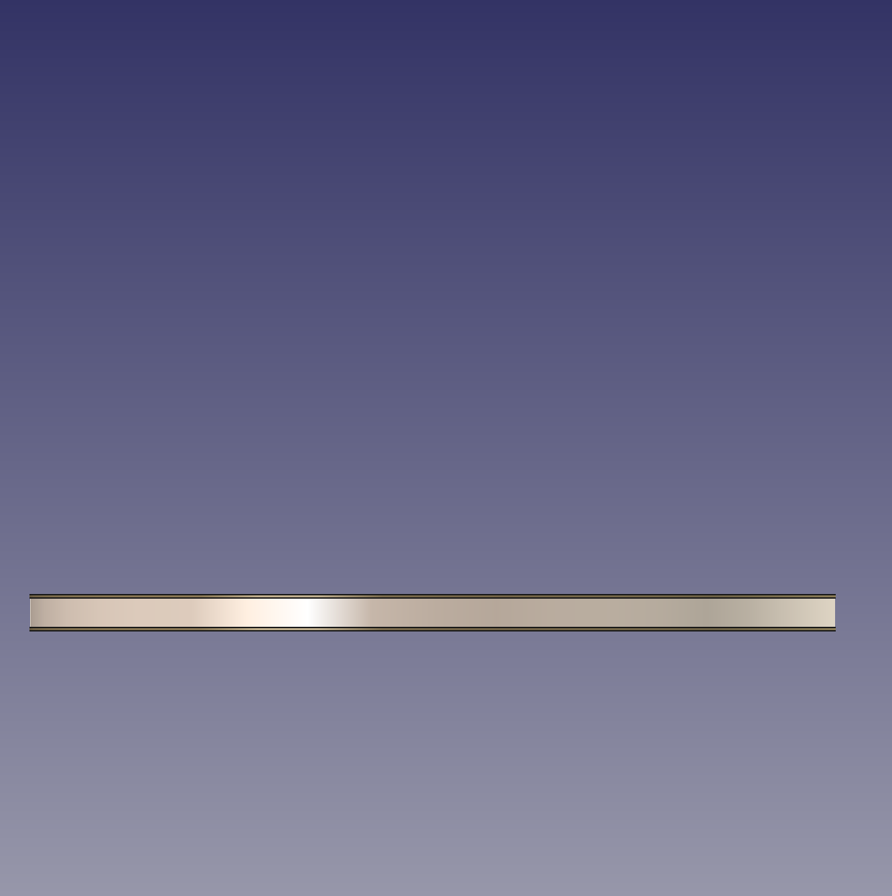

# Three Blade Design Schemes and Procurement List

## 1 Introduction

Based on the research conclusions of [Lightweight Material Density and Price Survey](./Research%20Report%20on%20Density%20and%20Price%20of%20Lightweight%20Table%20Tennis%20Racket%20Materials.en.md) and [Slim-Handle and Adjustable Handle Design Report](./Design%20Report%20on%20Slim-Handle%20and%20Adjustable%20Counterweight%20and%20Length%20Handles.en.md), this document proposes three progressively more aggressive design schemes for the Octo table tennis blade, aimed at materials that are actually obtainable, and attaches a detailed procurement list so that it can be used directly for purchasing and fabrication.

### 1.1 List of Available Materials

The following woods have been confirmed as currently obtainable:

| Material | Density (g/cm³) | Obtainable form | Intended use |
| :--- | :----------: | :--------- | :------- |
| **Limba** | 0.40–0.55 | Veneer (thin sheet, 0.5–0.6 mm) | Outer ply |
| **Kiri** | 0.23–0.40 | Sheet/board (customisable thickness) | Core/medial ply |
| **Balsa** | 0.10–0.20 | Sheet/board (customisable thickness) | Core |

> **Note**: since other woods such as beech, Ayous, and Koto are difficult to obtain, all three schemes below use only the three woods above plus optionally configured fibre materials (carbon-fibre cloth / ALC fibre cloth); fibre materials can be purchased independently via Taobao/Alibaba.

---

## 2 Scheme 1: Conservative — 3-Ply All-Wood Structure

### 2.1 Design Approach

A usable lightweight blade is achieved with the simplest 3-ply symmetric structure. Only three plies are used—**outer ply (Limba) + core (Balsa) + outer ply (Limba)**—with no fibre material added. The fabrication difficulty is the lowest, making it suitable as a **prototype** to verify the feel, weight, and fabrication process.

### 2.2 Structural Diagram

```
┌──────────────────────────────────┐
│  Limba outer ply   0.5 mm        │
├──────────────────────────────────┤
│  Balsa core        4.0–5.0 mm    │
├──────────────────────────────────┤
│  Limba outer ply   0.5 mm        │
└──────────────────────────────────┘
        Total thickness: 5.0–6.0 mm
```



### 2.3 Parameter Table

| Layer | Material | Thickness (mm) | Density (g/cm³) | Plies | Estimated weight (g) |
| :--- | :--- | :-------: | :----------: | :--: | :----------: |
| Outer ply | Limba | 0.5 | 0.50 | 2 | 9.5 |
| Core | Balsa | 4.0–5.0 | 0.15 | 1 | 11.4–14.3 |
| Glue | PVA glue | — | — | 2 layers | 1.5–2.0 |
| **Racket-face subtotal** | | **5.0–6.0** | | | **22.4–25.8** |

### 2.4 Total-Weight Estimation

| Component | Weight (g) |
| :--- | :------: |
| Racket face (bare blade) | 22–26 |
| Handle (shortened to 70 mm) | 12–15 |
| Surface coating (2–3 coats of polyurethane) | 2–3 |
| **Blade total weight** | **36–44** |
| Rubbers (ultra-light scheme, both sides) | 75 |
| **Total weight of finished racket** | **111–119** |

> **Analysis**: the blade weight is markedly below the 55–70 g target, and the overall finished-racket total weight of 111–119 g lies within the 110–130 g target range. The blade weight can be increased in the following ways:
> - Use a thicker Balsa core (6 mm → about +3 g)
> - Choose Balsa at the high-density end (0.20 g/cm³ → about +4 g)

### 2.5 Feel Prediction

- **Hardness**: very soft (the Balsa core is almost non-rigid; the Limba outer ply provides limited support)
- **Dwell feel**: excellent (Balsa has strong vibration absorption and a long dwell time)
- **Ball-exit speed**: slow–medium (relies on generating one's own force)
- **Sweet spot**: relatively small (the 3-ply structure lacks fibre/hardwood-layer support)

### 2.6 Applicability Assessment

⭐⭐⭐ — the simplest scheme, suitable for verifying the feel. The structure is on the soft side and may lack sufficient rebound support.

---

## 3 Scheme 2: Advanced — 5-Ply All-Wood Structure

### 3.1 Design Approach

On the basis of Scheme 1, two **Kiri medial plies** are added to form a 5-ply symmetric structure:

**Limba (outer ply) + Kiri (medial ply) + Balsa (core) + Kiri (medial ply) + Limba (outer ply)**

Although Kiri (density 0.23–0.40 g/cm³) is also a light, soft wood, its density is about 2–3 times that of Balsa, so it can provide additional structural support on both sides of the core and improve rigidity. This scheme remains a 100 % all-wood structure, fully ITTF-compliant, with moderate fabrication difficulty.

### 3.2 Structural Diagram

```
┌──────────────────────────────────┐
│  Limba outer ply    0.5 mm       │
├──────────────────────────────────┤
│  Kiri medial ply    0.8 mm       │
├──────────────────────────────────┤
│  Balsa core         2.9–3.5 mm   │
├──────────────────────────────────┤
│  Kiri medial ply    0.8 mm       │
├──────────────────────────────────┤
│  Limba outer ply    0.5 mm       │
└──────────────────────────────────┘
        Total thickness: 5.5–6.1 mm
```

### 3.3 Parameter Table

| Layer | Material | Thickness (mm) | Density (g/cm³) | Plies | Estimated weight (g) |
| :--- | :--- | :-------: | :----------: | :--: | :----------: |
| Outer ply | Limba | 0.5 | 0.50 | 2 | 9.5 |
| Medial ply | Kiri | 0.8 | 0.30 | 2 | 9.1 |
| Core | Balsa | 2.9–3.5 | 0.15 | 1 | 8.3–10.0 |
| Glue | PVA glue | — | — | 4 layers | 2.5–3.0 |
| **Racket-face subtotal** | | **5.5–6.1** | | | **29.4–31.6** |

### 3.4 Total-Weight Estimation

| Component | Weight (g) |
| :--- | :------: |
| Racket face (bare blade) | 29–32 |
| Handle (shortened to 70 mm) | 12–15 |
| Surface coating | 2–3 |
| **Blade total weight** | **43–50** |
| Rubbers (ultra-light scheme, both sides) | 75 |
| **Total weight of finished racket** | **118–125** |

> **Analysis**: the blade weighs 43–50 g, still below the 55–70 g target but significantly improved over Scheme 1. The finished total weight of 118–125 g lies within the target range. Thickening the core or switching to a heavier hardwood handle (+2–5 g) can adjust the blade weight to 55–60 g.

### 3.5 Feel Prediction

- **Hardness**: medium-soft (the Kiri medial plies provide some support; the Balsa core retains flexibility)
- **Dwell feel**: good (moderate dwell time)
- **Ball-exit speed**: medium (a marked improvement over Scheme 1)
- **Sweet spot**: medium (the 5-ply structure enlarges the effective hitting area)

### 3.6 Applicability Assessment

⭐⭐⭐⭐ — recommended as the **preferred all-wood scheme**. The structure is reasonable, and the feel is expected to achieve a good balance between flexibility and support. The fabrication difficulty is within the operable range of a high-school student.

---

## 4 Scheme 3: Aggressive — 5+2 Fibre Composite Structure

### 4.1 Design Approach

On the basis of Scheme 2, two layers of synthetic fibre material are embedded between the outer ply and the medial ply (**outer fibre**) or between the medial ply and the core (**inner fibre**), forming a 7-ply composite structure of 5 wood + 2 fibre.

The outer-fibre structure is as follows:
**Limba (outer ply) + fibre layer + Kiri (medial ply) + Balsa (core) + Kiri (medial ply) + fibre layer + Limba (outer ply)**

Fibre material options:

- **Carbon-fibre cloth**: low price (20–50 CNY/layer), high hardness, fast ball-exit speed
- **ALC fibre cloth (arylate-carbon blend)**: medium price (80–200 CNY/layer), soft feel, balanced performance

This is the **most complex, highest-performance, and most expensive** of the three schemes, and the one most capable of approaching the feel of a mainstream competition blade.

### 4.2 Structural Diagram (Outer-Fibre Version)

```
┌────────────────────────────────────┐
│  Limba outer ply          0.5 mm   │
├────────────────────────────────────┤
│  ★ Fibre layer (carbon/ALC) 0.2 mm │
├────────────────────────────────────┤
│  Kiri medial ply          0.6 mm   │
├────────────────────────────────────┤
│  Balsa core               3.0 mm   │
├────────────────────────────────────┤
│  Kiri medial ply          0.6 mm   │
├────────────────────────────────────┤
│  ★ Fibre layer (carbon/ALC) 0.2 mm │
├────────────────────────────────────┤
│  Limba outer ply          0.5 mm   │
└────────────────────────────────────┘
       Total thickness: 5.6 mm
```

### 4.3 Parameter Table

| Layer | Material | Thickness (mm) | Density (g/cm³) | Plies | Estimated weight (g) |
| :--- | :--- | :-------: | :----------: | :--: | :----------: |
| Outer ply | Limba | 0.5 | 0.50 | 2 | 9.5 |
| Fibre layer | Carbon/ALC | 0.2–0.23 | — | 2 | 2.2–2.6 (carbon) / 1.6–2.2 (ALC) |
| Medial ply | Kiri | 0.6 | 0.30 | 2 | 6.8 |
| Core | Balsa | 3.0 | 0.15 | 1 | 8.6 |
| Glue | Epoxy resin | — | — | 6 layers | 3.0–4.0 |
| **Racket-face subtotal** | | **5.6** | | | **30–33** |

### 4.4 Total-Weight Estimation

| Component | Weight (g) |
| :--- | :------: |
| Racket face (bare blade, ALC fibre) | 30–33 |
| Handle (shortened to 70 mm) | 12–15 |
| Surface coating | 2–3 |
| **Blade total weight** | **44–51** |
| Rubbers (ultra-light scheme, both sides) | 75 |
| **Total weight of finished racket** | **119–126** |

### 4.5 Feel Prediction

- **Hardness**: medium (the fibre layers markedly increase rigidity; the Balsa core retains flexibility)
- **Dwell feel**: the carbon version is on the short/crisp side; the ALC version has a better dwell feel
- **Ball-exit speed**: fast (the fibre layers provide clear rebound acceleration)
- **Sweet spot**: large (the fibre layers enlarge the sweet-spot range)

### 4.6 Outer vs. Inner Fibre Selection

| Comparison item | Outer fibre (recommended) | Inner fibre |
| :----- | :-------------: | :-------: |
| Structure | Limba → fibre → Kiri → Balsa | Limba → Kiri → fibre → Balsa |
| Ball-exit speed (low force) | Fast (fibre close to the surface, direct rebound) | Medium (the outer wood deforms first) |
| Feel clarity | Clearer, crisper | Softer, more wood-like |
| Dwell time | Relatively short | Relatively long |
| Fabrication difficulty | Same | Same |
| **Recommendation** | **Preferentially chosen (better for an attacking play style)** | Alternative (suitable for loop/control styles) |

### 4.7 Applicability Assessment

⭐⭐⭐⭐⭐ — the highest-performance scheme. The fibre layers compensate for the insufficient rigidity of the Balsa core and are expected to achieve a feel close to that of a mainstream competition blade. However, the fabrication difficulty is the highest (epoxy resin must be used to bond the fibre layers; pay attention to carbon-fibre dust safety).

---

## 5 Summary Comparison of the Three Schemes

### 5.1 Comparison of Core Parameters

| Comparison item | Scheme 1 (conservative) | Scheme 2 (advanced) | Scheme 3 (aggressive) |
| :----- | :-------------: | :-------------: | :-------------: |
| **Structure** | 3-ply all-wood | 5-ply all-wood | 5+2 fibre composite |
| **Plies** | 3 | 5 | 7 |
| **Total thickness** | 5.0–6.0 mm | 5.5–6.1 mm | ~5.6 mm |
| **Blade weight (est.)** | 36–44 g | 43–50 g | 44–51 g |
| **Finished total weight (est.)** | 111–119 g | 118–125 g | 119–126 g |
| **ITTF compliance** | ✅ 100 % wood | ✅ 100 % wood | ✅ wood >85 % |
| **Feel hardness** | Very soft | Medium-soft | Medium |
| **Ball-exit speed** | Slow–medium | Medium | Fast |
| **Fabrication difficulty** | ★☆☆☆☆ (very easy) | ★★☆☆☆ (easy) | ★★★★☆ (fairly difficult) |
| **Material cost** | ~50–80 CNY | ~70–100 CNY | ~100–180 CNY |
| **Recommended use** | Prototype validation | Main all-wood scheme | Ultimate scheme for performance |

### 5.2 Scheme-Selection Recommendations

- **First prototype** → preferentially make **Scheme 1** to confirm the bonding process and feel of Balsa + Limba.
- **Main scheme** → **Scheme 2** is recommended; the 5-ply all-wood structure achieves the best balance between performance and fabrication difficulty.
- **Performance-oriented** → take on **Scheme 3**; the combination of ALC fibre + Balsa core has the potential to achieve the best performance.

> **Note**: the blade weight of all three schemes is below the 55 g target and can be increased by thickening the core or switching to a heavier hardwood handle (+2–5 g) to approach the target.

---

## 6 Procurement List

### 6.1 Wood Procurement List

The following are all the wood materials required for the three schemes; **bold items are recommended for priority purchase**:

| # | Material | Use | Specification requirement | Quantity | Estimated unit price | Applicable scheme |
| :-: | :--- | :--- | :------- | :-: | :------: | :------- |
| 1 | **Limba veneer** | Outer ply | Thickness 0.5–0.6 mm, size ≥200×200 mm, no obvious knots on the surface | **3–5 sheets** | 10–25 CNY/sheet | Schemes 1/2/3 |
| 2 | **Kiri board** | Medial ply/core | Thickness 3–4 mm (can be split to 0.6–0.8 mm medial plies), choose the high-density end (Green Kiri, ~0.30 g/cm³) where possible, size ≥200×200 mm | **1–2 pieces** | 20–50 CNY/piece | Schemes 2/3 |
| 3 | **Balsa board** | Core | Model-aircraft grade, density 0.15–0.20 g/cm³ (avoid too light), thickness 4–6 mm (Scheme 1), 3–4 mm (Schemes 2/3), size ≥200×200 mm | **2–3 pieces** | 15–40 CNY/piece | Schemes 1/2/3 |

> **Procurement advice**:
> - Buy several extra sheets of Limba veneer (3–5 sheets), because thin veneer tends to crack during cutting and bonding and spares are needed.
> - For the Balsa board, preferentially buy the model-aircraft grade with a density of 0.15–0.20 g/cm³ (not too light); you can ask the seller to label the density.
> - Buy Kiri board at a thickness of 3–4 mm, hand-split it to 0.6–0.8 mm for the medial plies, and use the remainder as spare core stock.

### 6.2 Fibre-Material Procurement List (required only for Scheme 3)

| # | Material | Use | Specification requirement | Quantity | Estimated unit price | Procurement channel |
| :-: | :--- | :--- | :------- | :-: | :------: | :------- |
| 4a | Carbon-fibre cloth (woven carbon) | Fibre reinforcement layer | 200 g/m² or 240 g/m² plain-weave cloth, cut to ≥200×200 mm | 0.2 m² | 30–80 CNY/0.5 m² | Taobao/Alibaba |
| 4b | ALC fibre cloth (arylate-carbon blend) | Fibre reinforcement layer | Domestically produced blue arylate-carbon blend cloth, cut to the standard racket-face size | 1 sheet (approx. 200×200 mm) | 80–200 CNY/sheet | Taobao/table-tennis material shop |

> **Note**: choose either 4a or 4b. Preferentially try **4b (ALC fibre cloth)** first, as the feel is softer and better suited to target users with less strength. Carbon-fibre cloth has a harder feel but costs only 1/3–1/4 of ALC.

### 6.3 Handle-Material Procurement List (common)

| # | Material | Use | Specification requirement | Quantity | Estimated unit price |
| :-: | :--- | :--- | :------- | :-: | :------: |
| 5 | **Pine/Kiri strip** | Handle body | ≈30×30×100 mm (can be carved and sanded to shape) | 2 strips | 5–10 CNY |
| 6 | **Cork sheet** | Handle anti-slip covering | Thickness 1.5–2.0 mm, size ≥30×100 mm | 2 sheets | 5–15 CNY/sheet |

### 6.4 Auxiliary-Material and Tool Procurement List

| # | Item | Quantity | Estimated unit price | Use |
| :-: | :--- | :-: | :------: | :--- |
| 7 | **PVA glue (wood bonding)** | 1 bottle (250 ml) | 15–25 CNY | Interlayer bonding of the all-wood schemes (Schemes 1/2) |
| 8 | **Epoxy resin glue (AB glue)** | 1 set (approx. 50 g) | 20–40 CNY | Fibre-layer bonding (Scheme 3) |
| 9 | **Electronic balance (0.01 g precision)** | 1 | 40–80 CNY | Accurate weighing of each layer |
| 10 | **Digital caliper (0.01 mm)** | 1 | 30–60 CNY | Accurate thickness measurement |
| 11 | **G-clamps / clamps** | 4 | 10–20 CNY each | Pressurised fixing during bonding |
| 12 | **Sandpaper (#80–#400 set)** | 5 sheets each | 15–30 CNY | Sanding to shape |
| 13 | **Measuring cup + stirring rod** | 1 set | 10–20 CNY | Mixing epoxy resin |

### 6.5 Budget Summary

| Procurement item | Scheme 1 (conservative) | Scheme 2 (advanced) | Scheme 3 (aggressive) |
| :----- | :-----------: | :-----------: | :-----------: |
| Wood (Limba + Balsa + Kiri) | 50–80 CNY | 70–100 CNY | 70–100 CNY |
| Fibre material | — | — | 30–200 CNY |
| Handle material | 10–25 CNY | 10–25 CNY | 10–25 CNY |
| Auxiliary materials and tools | 120–255 CNY | 120–255 CNY | 140–275 CNY |
| **Total (incl. tools)** | **~180–360 CNY** | **~200–380 CNY** | **~250–600 CNY** |
| **Total (excl. tools)** | **~60–105 CNY** | **~80–125 CNY** | **~110–325 CNY** |

> **Note**: the tools (balance, caliper, clamps, sandpaper, etc.) are a one-time investment and can be reused for subsequent schemes.

---

## 7 Recommended Prototyping Route

Given the technical conditions and budget of a high-school student team, the following phased prototyping route is recommended:

```
Phase 1 (Scheme 1)
  ├ Objective: validate the Limba + Balsa bonding process and make an initial assessment of feel
  ├ Budget: ~60–105 CNY (materials only)
  └ Duration: 1–2 days

Phase 2 (Scheme 2)
  ├ Objective: validate the feel and stiffness of the 5-ply structure, comparing it with Scheme 1
  ├ Budget: ~80–125 CNY (materials only)
  └ Duration: 2–3 days

Phase 3 (Scheme 3, optional)
  ├ Objective: validate the performance of the 5+2 fibre composite structure
  ├ Budget: ~110–325 CNY (incl. fibre material)
  ├ Duration: 3–5 days (fibre-layer bonding requires curing time)
  └ Note: epoxy resin is required; ensure ventilation and safety
```

### 7.1 Key Points to Note

1. **Sealing treatment of Balsa**: Balsa is porous and absorbs moisture easily. Before bonding, apply a thin coat of woodworking PVA glue (diluted to 50 %) to the Balsa surface, and wait for it to dry before interlayer bonding, to prevent excessive glue from penetrating the Balsa pores and causing weight gain.
2. **Limba veneer is very thin (0.5 mm)**: handle with care when cutting. A sharp utility knife + straightedge is recommended for cutting along the grain, or use scissors. Be sure to use a cutting mat.
3. **Bonding and pressing**: after applying glue between the layers, press evenly with G-clamps for at least 4–6 hours (PVA glue) or 12–24 hours (epoxy resin) to ensure the layers fit tightly together. Place wooden blocks or rubber sheets between the wood and the clamps to prevent the clamps from leaving indentations on the wood surface.
4. **Cutting the fibre layers (Scheme 3)**: wear gloves and a mask when cutting carbon-fibre and ALC fibre cloth, as the fibre debris is irritating to the skin. It is recommended to stick tape on both sides of the cutting line before cutting, which effectively reduces fraying.

### 7.2 Safety Notes

- Wear a **dust mask and safety goggles** when cutting/sanding wood (see [Experimental Safety Instructions](../Experimental%20Safety%20Instructions.en.md)).
- Mix epoxy resin in a **well-ventilated place**, wearing nitrile gloves.
- For carbon-fibre cutting operations, refer to Section 3.2.1 of [Experimental Safety Instructions](../Experimental%20Safety%20Instructions.en.md).

---

## References

[^1]: [Lightweight Material Density and Price Survey](./Research%20Report%20on%20Density%20and%20Price%20of%20Lightweight%20Table%20Tennis%20Racket%20Materials.en.md)
[^2]: [Slim-Handle and Adjustable Handle Design Report](./Design%20Report%20on%20Slim-Handle%20and%20Adjustable%20Counterweight%20and%20Length%20Handles.en.md)
[^3]: [Blade Base-Material Study](../%E9%98%B6%E6%AE%B51-%E5%89%8D%E7%BD%AE%E5%87%86%E5%A4%87/Research%20Report%20on%20Table%20Tennis%20Blade%20Materials.en.md)
[^4]: [Standard Racket Technical Baseline](../%E9%98%B6%E6%AE%B51-%E5%89%8D%E7%BD%AE%E5%87%86%E5%A4%87/Standard%20Table%20Tennis%20Racket%20Technical%20Parameter%20Baseline%20Report.en.md)
[^5]: [Experimental Safety Instructions](../Experimental%20Safety%20Instructions.en.md)


