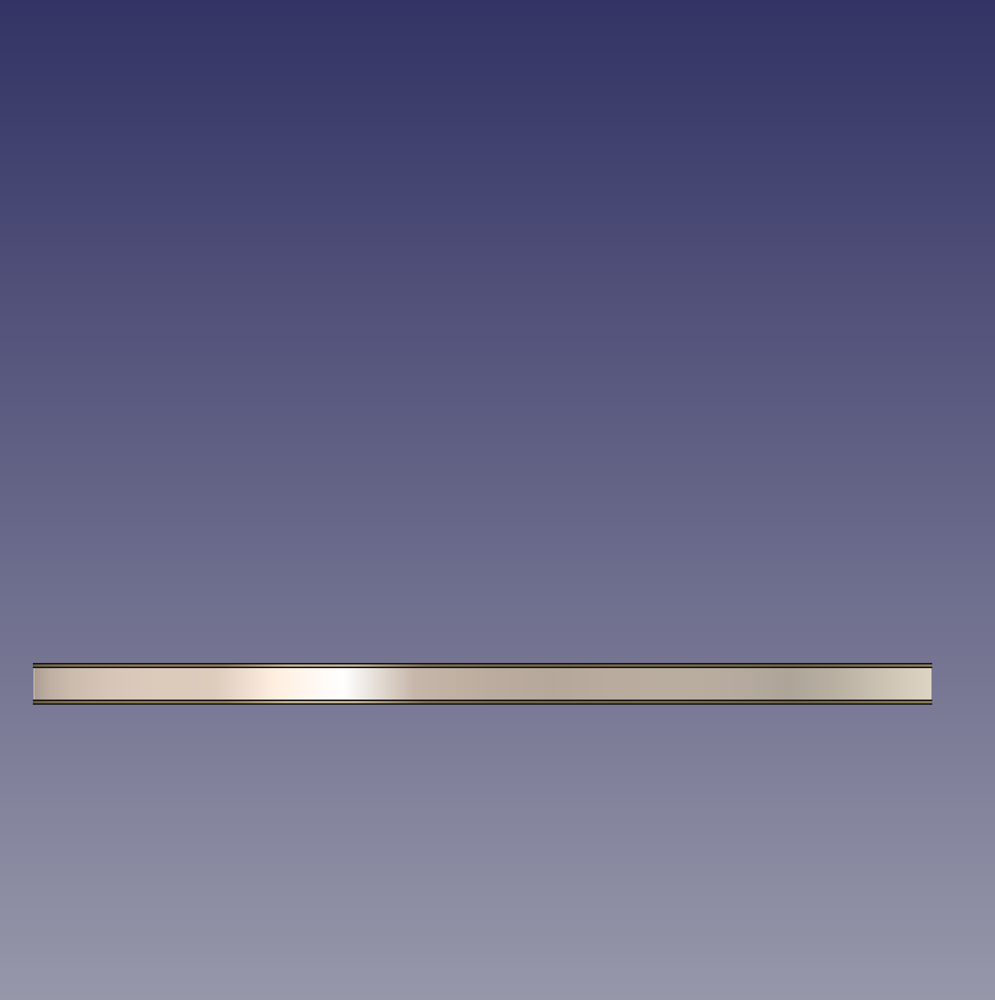

# 三套底板设计方案及采购清单

## 1 引言

根据[轻质乒乓球拍材料密度与价格调研报告](./%E8%BD%BB%E8%B4%A8%E4%B9%92%E4%B9%93%E7%90%83%E6%8B%8D%E6%9D%90%E6%96%99%E5%AF%86%E5%BA%A6%E4%B8%8E%E4%BB%B7%E6%A0%BC%E8%B0%83%E7%A0%94%E6%8A%A5%E5%91%8A.md)与[细柄拍及可调配重长度握柄设计报告](./%E7%BB%86%E6%9F%84%E6%8B%8D%E5%8F%8A%E5%8F%AF%E8%B0%83%E9%85%8D%E9%87%8D%E9%95%BF%E5%BA%A6%E6%8F%A1%E6%9F%84%E8%AE%BE%E8%AE%A1%E6%8A%A5%E5%91%8A.md)的研究结论，本文件针对实际可获取的材料，提出三套逐步激进的 Octo 乒乓球拍底板设计方案，并附详细的采购清单，以便直接用于采购和加工。

### 1.1 可用材料清单

经确认，目前可获取的木材如下：

| 材料 | 密度 (g/cm³) | 可获取形态 | 预期用途 |
| :--- | :----------: | :--------- | :------- |
| **林巴（Limba）** | 0.40–0.55 | 木皮（薄片，0.5–0.6 mm） | 面材 |
| **桐木（Kiri）** | 0.23–0.40 | 木片/板（厚度可定制） | 大芯/力材 |
| **巴尔沙木（Balsa）** | 0.10–0.20 | 木片/板（厚度可定制） | 大芯 |

> **说明**：由于榉木、阿尤斯、蔻头等其他木材难以获取，以下三套方案均仅使用上述三种木材及可选配的纤维材料（碳纤维布 / ALC 纤维布），纤维材料可通过淘宝/阿里巴巴独立采购。

---

## 2 方案一：保守型 — 3 层纯木结构

### 2.1 设计思路

以最简单的 3 层对称结构实现一块可用的轻量底板。仅使用**面材（Limba）+ 大芯（Balsa）+ 面材（Limba）**三层，不添加任何纤维材料。加工难度最低，适合作为**初号打样**，用于验证手感、重量和加工工艺。

### 2.2 结构示意图

```
┌──────────────────────────────────┐
│  Limba 面材  0.5 mm              │
├──────────────────────────────────┤
│  Balsa 大芯  4.0–5.0 mm          │
├──────────────────────────────────┤
│  Limba 面材  0.5 mm              │
└──────────────────────────────────┘
        总厚度：5.0–6.0 mm
```


### 2.3 参数表

| 层位 | 材料 | 厚度 (mm) | 密度 (g/cm³) | 层数 | 重量估算 (g) |
| :--- | :--- | :-------: | :----------: | :--: | :----------: |
| 面材 | Limba | 0.5 | 0.50 | 2 | 9.5 |
| 大芯 | Balsa | 4.0–5.0 | 0.15 | 1 | 11.4–14.3 |
| 胶水 | 白乳胶 | — | — | 2 层 | 1.5–2.0 |
| **拍面小计** | | **5.0–6.0** | | | **22.4–25.8** |

### 2.4 总重估算

| 组件 | 重量 (g) |
| :--- | :------: |
| 拍面（裸板） | 22–26 |
| 握柄（缩短至 70 mm） | 12–15 |
| 表面涂层（聚氨酯 2–3 层） | 2–3 |
| **底板总重** | **36–44** |
| 套胶（极致轻量方案，两面） | 75 |
| **成品总重** | **111–119** |

> **分析**：底板重量显著低于 55–70 g 的目标，整体成品总重 111–119 g 在 110–130 g 目标范围内。可通过以下方式增加底板重量：
> - 使用更厚的 Balsa 大芯（6 mm → 增重 ~3 g）
> - 选用高密度端的 Balsa（0.20 g/cm³ → 增重 ~4 g）
> - 增加握柄配重（详见[细柄拍及可调配重长度握柄设计报告](./%E7%BB%86%E6%9F%84%E6%8B%8D%E5%8F%8A%E5%8F%AF%E8%B0%83%E9%85%8D%E9%87%8D%E9%95%BF%E5%BA%A6%E6%8F%A1%E6%9F%84%E8%AE%BE%E8%AE%A1%E6%8A%A5%E5%91%8A.md)的方案 F）

### 2.5 手感预测

- **硬度**：极软（Balsa 大芯几乎无刚性，Limba 面材提供有限支撑）
- **持球感**：极佳（Balsa 吸震性强，持球时间长）
- **出球速度**：慢—中等（需依靠自身发力）
- **甜区**：较小（三层结构缺乏纤维/硬木层支撑）

### 2.6 适用性评价

⭐⭐⭐ — 最简方案，适合验证手感。结构偏软，可能缺乏足够的回弹支撑力。

---

## 3 方案二：进阶型 — 5 层纯木结构

### 3.1 设计思路

在方案一的基础上增加两层**桐木力材**，形成 5 层对称结构：

**Limba(面材) + Kiri(力材) + Balsa(大芯) + Kiri(力材) + Limba(面材)**

桐木（Kiri，密度 0.23–0.40 g/cm³）虽然本身也属于轻软木材，但其密度约为 Balsa 的 2–3 倍，可在大芯两侧提供额外的结构支撑，改善刚性。该方案仍然为 100% 纯木结构，完全 ITTF 合规，加工难度适中。

### 3.2 结构示意图

```
┌──────────────────────────────────┐
│  Limba 面材          0.5 mm      │
├──────────────────────────────────┤
│  Kiri 力材           0.8 mm      │
├──────────────────────────────────┤
│  Balsa 大芯          2.9–3.5 mm  │
├──────────────────────────────────┤
│  Kiri 力材           0.8 mm      │
├──────────────────────────────────┤
│  Limba 面材          0.5 mm      │
└──────────────────────────────────┘
        总厚度：5.5–6.1 mm
```

### 3.3 参数表

| 层位 | 材料 | 厚度 (mm) | 密度 (g/cm³) | 层数 | 重量估算 (g) |
| :--- | :--- | :-------: | :----------: | :--: | :----------: |
| 面材 | Limba | 0.5 | 0.50 | 2 | 9.5 |
| 力材 | Kiri | 0.8 | 0.30 | 2 | 9.1 |
| 大芯 | Balsa | 2.9–3.5 | 0.15 | 1 | 8.3–10.0 |
| 胶水 | 白乳胶 | — | — | 4 层 | 2.5–3.0 |
| **拍面小计** | | **5.5–6.1** | | | **29.4–31.6** |

### 3.4 总重估算

| 组件 | 重量 (g) |
| :--- | :------: |
| 拍面（裸板） | 29–32 |
| 握柄（缩短至 70 mm） | 12–15 |
| 表面涂层 | 2–3 |
| **底板总重** | **43–50** |
| 套胶（极致轻量方案，两面） | 75 |
| **成品总重** | **118–125** |

> **分析**：底板重 43–50 g，仍低于 55–70 g 目标，但已比方案一显著提升。成品总重 118–125 g 在目标范围内。可通过握柄配重（+3–12 g）将底板调整至 55–60 g，同时帮助重心后移。

### 3.5 手感预测

- **硬度**：中等偏软（Kiri 力材提供一定支撑，Balsa 大芯保持柔韧）
- **持球感**：良好（持球时间适中）
- **出球速度**：中等（较方案一有明显提升）
- **甜区**：中等（五层结构扩大了有效击球区域）

### 3.6 适用性评价

⭐⭐⭐⭐ — 推荐作为**首选纯木方案**。结构合理，手感预计在柔韧与支撑之间取得较好平衡。加工难度在高中生可操作范围内。

---

## 4 方案三：激进型 — 5+2 纤维复合结构

### 4.1 设计思路

在方案二的基础上，于面材与力材之间（**外置纤维**）或力材与大芯之间（**内置纤维**）嵌入两层合成纤维材料，形成 5 木 + 2 纤维的 7 层复合结构。

外置纤维结构如下：
**Limba(面材) + 纤维层 + Kiri(力材) + Balsa(大芯) + Kiri(力材) + 纤维层 + Limba(面材)**

纤维材料可选：
- **碳纤维布（Carbon Fiber）**：价格低（20–50 元/层），硬度高，出球速度快
- **ALC 纤维布（芳碳混编）**：价格中等（80–200 元/层），手感柔和，性能均衡

这是三套方案中**结构最复杂、性能最强、成本最高**的方案，也是最能接近主流竞赛底板手感的方案。

### 4.2 结构示意图（外置纤维版）

```
┌──────────────────────────────────┐
│  Limba 面材          0.5 mm      │
├──────────────────────────────────┤
│  ★ 纤维层（碳布/ALC）  0.2 mm    │
├──────────────────────────────────┤
│  Kiri 力材           0.6 mm      │
├──────────────────────────────────┤
│  Balsa 大芯          3.0 mm      │
├──────────────────────────────────┤
│  Kiri 力材           0.6 mm      │
├──────────────────────────────────┤
│  ★ 纤维层（碳布/ALC）  0.2 mm    │
├──────────────────────────────────┤
│  Limba 面材          0.5 mm      │
└──────────────────────────────────┘
       总厚度：5.6 mm
```

### 4.3 参数表

| 层位 | 材料 | 厚度 (mm) | 密度 (g/cm³) | 层数 | 重量估算 (g) |
| :--- | :--- | :-------: | :----------: | :--: | :----------: |
| 面材 | Limba | 0.5 | 0.50 | 2 | 9.5 |
| 纤维层 | 碳纤维/ALC | 0.2–0.23 | — | 2 | 2.2–2.6 (碳) / 1.6–2.2 (ALC) |
| 力材 | Kiri | 0.6 | 0.30 | 2 | 6.8 |
| 大芯 | Balsa | 3.0 | 0.15 | 1 | 8.6 |
| 胶水 | 环氧树脂 | — | — | 6 层 | 3.0–4.0 |
| **拍面小计** | | **5.6** | | | **30–33** |

### 4.4 总重估算

| 组件 | 重量 (g) |
| :--- | :------: |
| 拍面（裸板，ALC 纤维） | 30–33 |
| 握柄（缩短至 70 mm） | 12–15 |
| 表面涂层 | 2–3 |
| **底板总重** | **44–51** |
| 套胶（极致轻量方案，两面） | 75 |
| **成品总重** | **119–126** |

### 4.5 手感预测

- **硬度**：中等（纤维层显著提升刚性，Balsa 大芯保持柔韧）
- **持球感**：碳纤维版偏短促，ALC 版持球感较好
- **出球速度**：快（纤维层提供明显的回弹加速）
- **甜区**：大（纤维层扩大了甜区范围）

### 4.6 纤维内置 vs 外置选择

| 对比项 | 外置纤维（推荐） | 内置纤维 |
| :----- | :-------------: | :-------: |
| 结构 | Limba → 纤维 → Kiri → Balsa | Limba → Kiri → 纤维 → Balsa |
| 出球速度（小力量） | 快（纤维靠近表面，直接反弹） | 中等（外层木材先形变） |
| 手感清晰度 | 更清晰、更脆 | 更柔和、更具木材感 |
| 持球时间 | 较短 | 较长 |
| 加工难度 | 相同 | 相同 |
| **推荐** | **优先选择（更适合进攻型打法）** | 备选（适合弧圈/控制型） |

### 4.7 适用性评价

⭐⭐⭐⭐⭐ — 性能最强方案。纤维层补偿了 Balsa 大芯刚性的不足，有望实现接近主流竞赛底板的手感。但加工难度最高（需使用环氧树脂粘合纤维层，注意碳纤维粉尘安全）。

---

## 5 三方案对比汇总

### 5.1 核心参数对比

| 对比项 | 方案一（保守型） | 方案二（进阶型） | 方案三（激进型） |
| :----- | :-------------: | :-------------: | :-------------: |
| **结构** | 3 层纯木 | 5 层纯木 | 5+2 纤维复合 |
| **层数** | 3 | 5 | 7 |
| **总厚度** | 5.0–6.0 mm | 5.5–6.1 mm | ~5.6 mm |
| **底板重（估）** | 36–44 g | 43–50 g | 44–51 g |
| **成品总重（估）** | 111–119 g | 118–125 g | 119–126 g |
| **ITTF 合规** | ✅ 100% 木材 | ✅ 100% 木材 | ✅ 木材 >85% |
| **手感硬度** | 极软 | 中等偏软 | 中等 |
| **出球速度** | 慢—中等 | 中等 | 快 |
| **加工难度** | ★☆☆☆☆（极易） | ★★☆☆☆（容易） | ★★★★☆（较难） |
| **材料成本** | ~50–80 元 | ~70–100 元 | ~100–180 元 |
| **推荐用途** | 初号打样验证 | 主力纯木方案 | 追求性能的终极方案 |

### 5.2 选型建议

- **首次打样** → 优先制作**方案一**，确认 Balsa + Limba 的粘合工艺和手感
- **主力方案** → 推荐**方案二**，5 层纯木结构在性能与加工难度之间取得最佳平衡
- **追求性能** → 挑战**方案三**，ALC 纤维 + Balsa 大芯的组合有潜力达到最佳性能

> **提示**：三套方案的底板重量均低于 55 g 目标，可通过握柄配重（见[细柄拍及可调配重长度握柄设计报告](./%E7%BB%86%E6%9F%84%E6%8B%8D%E5%8F%8A%E5%8F%AF%E8%B0%83%E9%85%8D%E9%87%8D%E9%95%BF%E5%BA%A6%E6%8F%A1%E6%9F%84%E8%AE%BE%E8%AE%A1%E6%8A%A5%E5%91%8A.md)方案 F）增加 3–12 g 以达标并实现重心后移。

---

## 6 采购清单

### 6.1 木材采购清单

以下为三套方案所需的全部木材材料，**加粗项为推荐优先购买**：

| # | 材料 | 用途 | 规格要求 | 数量 | 预估单价 | 适用方案 |
| :-: | :--- | :--- | :------- | :-: | :------: | :------- |
| 1 | **林巴（Limba）木皮** | 面材 | 厚度 0.5–0.6 mm，尺寸 ≥200×200 mm，表面无明显节疤 | **3–5 张** | 10–25 元/张 | 方案一/二/三 |
| 2 | **桐木（Kiri）板** | 力材/大芯 | 厚度 3–4 mm（可从中间剖薄为 0.6–0.8 mm 力材），密度尽量选高密度端（青桐木，~0.30 g/cm³），尺寸 ≥200×200 mm | **1–2 片** | 20–50 元/片 | 方案二/三 |
| 3 | **巴尔沙木（Balsa）板** | 大芯 | 航模级，密度 0.15–0.20 g/cm³（避免过轻），厚度 4–6 mm（方案一）、3–4 mm（方案二/三），尺寸 ≥200×200 mm | **2–3 片** | 15–40 元/片 | 方案一/二/三 |

> **采购建议**：
> - Limba 木皮多买几张（3–5 张），因为薄木皮在切割和粘合过程中容易开裂，需要备件
> - Balsa 板优先买密度 0.15–0.20 g/cm³ 的航模级（不要太轻），可让老板标注密度
> - Kiri 板买 3–4 mm 厚度的，手工剖薄至 0.6–0.8 mm 用于力材层，剩余部分可用作大芯备料

### 6.2 纤维材料采购清单（仅方案三需要）

| # | 材料 | 用途 | 规格要求 | 数量 | 预估单价 | 采购渠道 |
| :-: | :--- | :--- | :------- | :-: | :------: | :------- |
| 4a | 碳纤维布（编织碳） | 纤维增强层 | 200 g/m² 或 240 g/m² 平纹编织布，裁剪至 ≥200×200 mm | 0.2 m² | 30–80 元/0.5 m² | 淘宝/阿里巴巴 |
| 4b | ALC 纤维布（芳碳混编） | 纤维增强层 | 国产蓝芳碳混编布，裁剪至标准拍面大小 | 1 张（约 200×200 mm） | 80–200 元/张 | 淘宝/乒乓材料店 |

> **说明**：4a 和 4b 二选一。推荐优先尝试 **4b（ALC 纤维布）**，手感更柔和，更适合力量较小的目标用户。碳纤维布手感偏硬，但价格仅为 ALC 的 1/3–1/4。

### 6.3 握柄材料采购清单（通用）

| # | 材料 | 用途 | 规格要求 | 数量 | 预估单价 |
| :-: | :--- | :--- | :------- | :-: | :------: |
| 5 | **松木/桐木条** | 握柄主体 | ≈30×30×100 mm（可雕刻打磨成型） | 2 条 | 5–10 元 |
| 6 | **软木片（Cork）** | 握柄防滑覆盖 | 厚度 1.5–2.0 mm，尺寸 ≥30×100 mm | 2 张 | 5–15 元/张 |

### 6.4 辅料与工具采购清单

| # | 物品 | 数量 | 预估单价 | 用途 |
| :-: | :--- | :-: | :------: | :--- |
| 7 | **白乳胶（木材粘合）** | 1 瓶（250 ml） | 15–25 元 | 纯木方案（方案一/二）的层间粘合 |
| 8 | **环氧树脂胶（AB 胶）** | 1 份（约 50 g） | 20–40 元 | 纤维层粘合（方案三）；配重密封 |
| 9 | **电子天平（0.01 g 精度）** | 1 台 | 40–80 元 | 精确称量各层材料重量 |
| 10 | **数显卡尺（0.01 mm）** | 1 把 | 30–60 元 | 精确测量厚度 |
| 11 | **G 形夹 / 夹具** | 4 个 | 10–20 元/个 | 粘合加压固定 |
| 12 | **砂纸（#80–#400 套装）** | 各 5 张 | 15–30 元 | 打磨成型 |
| 13 | **量杯 + 搅拌棒** | 1 套 | 10–20 元 | 调配环氧树脂 |

### 6.5 预算汇总

| 采购项 | 方案一（保守） | 方案二（进阶） | 方案三（激进） |
| :----- | :-----------: | :-----------: | :-----------: |
| 木材（Limba + Balsa + Kiri） | 50–80 元 | 70–100 元 | 70–100 元 |
| 纤维材料 | — | — | 30–200 元 |
| 握柄材料 | 10–25 元 | 10–25 元 | 10–25 元 |
| 辅料与工具 | 120–255 元 | 120–255 元 | 140–275 元 |
| **合计（含工具）** | **~180–360 元** | **~200–380 元** | **~250–600 元** |
| **合计（不含工具）** | **~60–105 元** | **~80–125 元** | **~110–325 元** |

> **注**：工具（天平、卡尺、夹具、砂纸等）为一次性投资，后续方案可复用。

---

## 7 打样建议路线

根据高中生团队的技术条件和预算，推荐以下分阶段打样路线：

```
第一阶段（方案一）
  ├ 目标：验证 Limba + Balsa 粘合工艺、手感初判
  ├ 预算：~60–105 元（仅材料）
  └ 工期：1–2 天

第二阶段（方案二）
  ├ 目标：验证 5 层结构的手感与刚度，与方案一对比
  ├ 预算：~80–125 元（仅材料）
  └ 工期：2–3 天

第三阶段（方案三，可选）
  ├ 目标：验证 5+2 纤维复合结构性能
  ├ 预算：~110–325 元（含纤维材料）
  ├ 工期：3–5 天（纤维层粘合需固化时间）
  └ 注意：需使用环氧树脂，注意通风和安全
```

### 7.1 关键注意事项

1. **Balsa 的密封处理**：Balsa 木材多孔易吸湿，建议粘合前在 Balsa 表面涂刷一层稀薄的木工白胶（稀释 50%），待干后再进行层间粘合，以防止胶水过度渗入 Balsa 孔隙导致增重。
2. **Limba 木皮很薄（0.5 mm）**：切割时需小心，推荐使用锋利美工刀 + 直尺沿木纹方向切割，或使用剪刀裁剪。务必使用切割垫板。
3. **粘合加压**：层间涂胶后需用 G 形夹均匀加压至少 4–6 小时（白乳胶）或 12–24 小时（环氧树脂），确保各层紧密贴合。在木材与夹具之间垫木块或橡胶片，防止夹具在木材表面留下压痕。
4. **纤维层裁剪（方案三）**：碳纤维和 ALC 纤维布裁剪时需佩戴手套和口罩，纤维碎屑有皮肤刺激性。建议用胶带在裁剪线两侧粘贴后再剪，可有效减少毛边。

### 7.2 安全提示

- 木材切割/打磨时请佩戴 **防尘口罩和护目镜**（见[实验操作安全说明](../%E5%AE%9E%E9%AA%8C%E6%93%8D%E4%BD%9C%E5%AE%89%E5%85%A8%E8%AF%B4%E6%98%8E.md)）
- 环氧树脂调配请在**通风良好处**进行，佩戴丁腈手套
- 碳纤维裁剪操作请参考[实验操作安全说明](../%E5%AE%9E%E9%AA%8C%E6%93%8D%E4%BD%9C%E5%AE%89%E5%85%A8%E8%AF%B4%E6%98%8E.md)第 3.2.1 节

---

## 参考文献

[^1]: [轻质乒乓球拍材料密度与价格调研报告](./%E8%BD%BB%E8%B4%A8%E4%B9%92%E4%B9%93%E7%90%83%E6%8B%8D%E6%9D%90%E6%96%99%E5%AF%86%E5%BA%A6%E4%B8%8E%E4%BB%B7%E6%A0%BC%E8%B0%83%E7%A0%94%E6%8A%A5%E5%91%8A.md)
[^2]: [细柄拍及可调配重长度握柄设计报告](./%E7%BB%86%E6%9F%84%E6%8B%8D%E5%8F%8A%E5%8F%AF%E8%B0%83%E9%85%8D%E9%87%8D%E9%95%BF%E5%BA%A6%E6%8F%A1%E6%9F%84%E8%AE%BE%E8%AE%A1%E6%8A%A5%E5%91%8A.md)
[^3]: [乒乓球拍底板材料研究报告](../%E9%98%B6%E6%AE%B51-%E5%89%8D%E7%BD%AE%E5%87%86%E5%A4%87/%E4%B9%92%E4%B9%93%E7%90%83%E6%8B%8D%E5%BA%95%E6%9D%BF%E6%9D%90%E6%96%99%E7%A0%94%E7%A9%B6%E6%8A%A5%E5%91%8A.md)
[^4]: [标准乒乓球拍技术参数基线报告](../%E9%98%B6%E6%AE%B51-%E5%89%8D%E7%BD%AE%E5%87%86%E5%A4%87/%E6%A0%87%E5%87%86%E4%B9%92%E4%B9%93%E7%90%83%E6%8B%8D%E6%8A%80%E6%9C%AF%E5%8F%82%E6%95%B0%E5%9F%BA%E7%BA%BF%E6%8A%A5%E5%91%8A.md)
[^5]: [实验操作安全说明](../%E5%AE%9E%E9%AA%8C%E6%93%8D%E4%BD%9C%E5%AE%89%E5%85%A8%E8%AF%B4%E6%98%8E.md)
